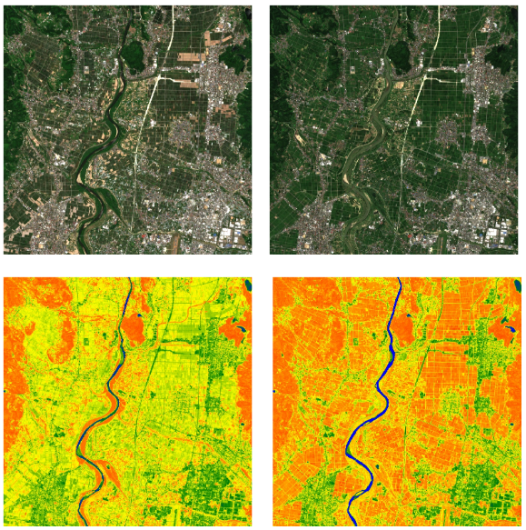
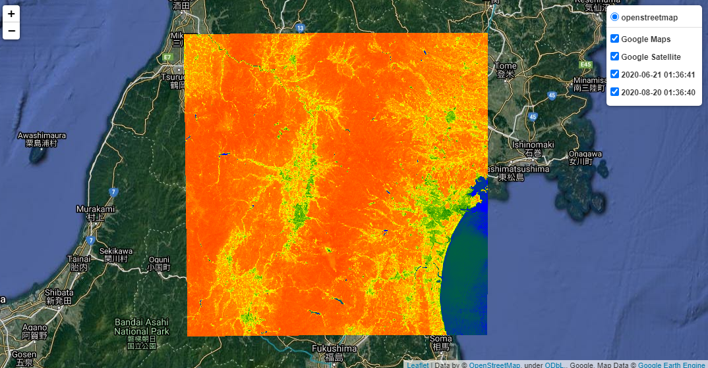

# Google Earth Engine NDWI Maps

This Jupyter Notebook provides an approach that uses Python to import Sentinel-2 satellite imagery for a given region of interest and a given time span. It then produces an interactive web map using the Folium leaflet library.

## Example leaflet output

https://yohman.github.io/remote-sensing-ndwi/kumamoto.html
